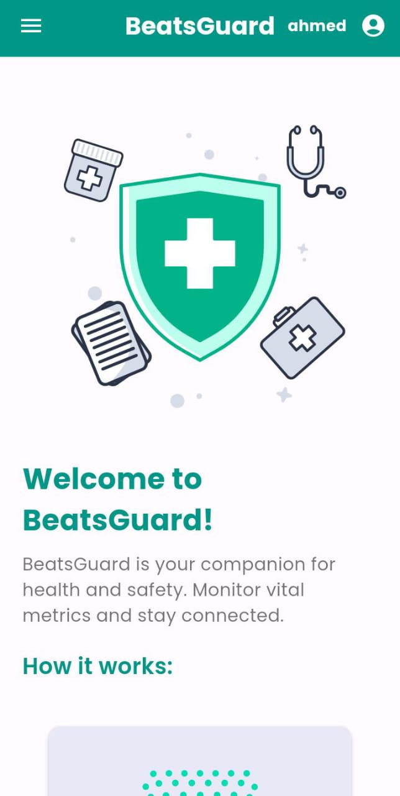
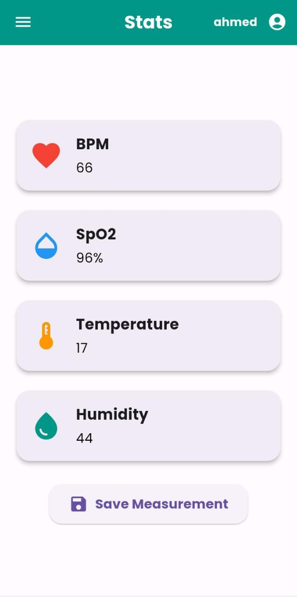
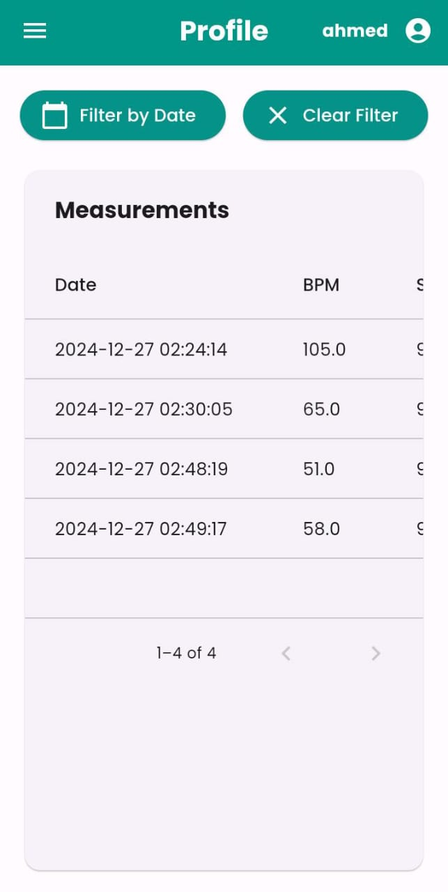
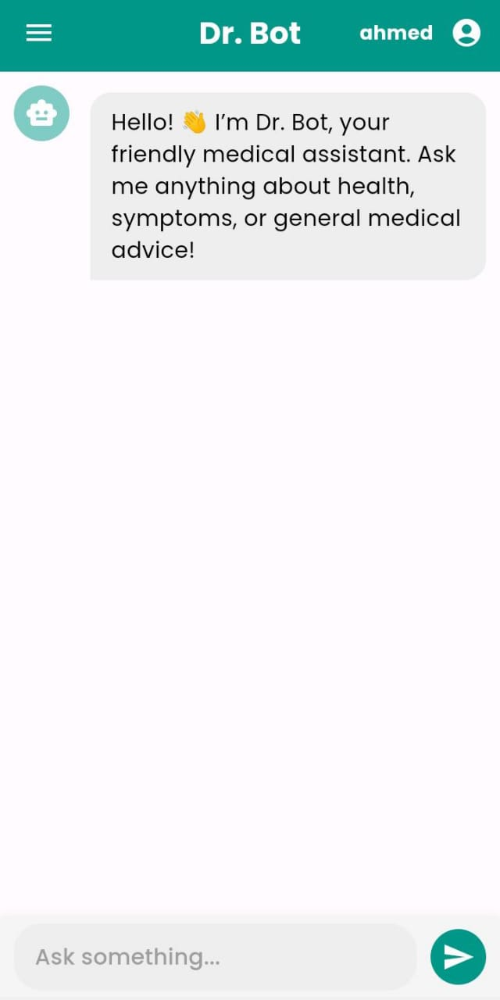

# BeatsGuard Flutter App

BeatsGuard is a Flutter-based application designed for monitoring real-time health metrics such as BPM, SpO2, temperature, and humidity. The app integrates with a BLE (Bluetooth Low Energy) device to fetch sensor data and provides functionalities like saving measurements, viewing historical data, and managing user profiles.

## Features

- **Real-Time Sensor Monitoring**:
  - BPM (Heart Rate)
  - SpO2 (Oxygen Saturation)
  - Temperature
  - Humidity
- **BLE Device Integration**:
  - Auto-connect to a specified BLE device
  - Reconnect functionality for lost connections
  - Test connection to verify device functionality
- **Measurement Management**:
  - Save current measurements to the backend
  - View historical measurements in a paginated, filterable table
- **User Profiles**:
  - Manage and view user-specific measurements
- **Theming**:
  - Styled with teal as the primary color

## Screenshots




## Tech Stack

- **Frontend**: Flutter (Dart)
- **Backend**: Spring Boot
- **Database**: MySQL
- **State Management**: Provider

## Installation

### Prerequisites

1. Flutter SDK ([installation guide](https://docs.flutter.dev/get-started/install)).
2. Android Studio or Visual Studio Code with Flutter extensions.
3. A compatible BLE device for testing.
4. Backend server (Spring Boot).

### Steps

1. Clone the repository:
   ```bash
   git clone https://github.com/AhmedFatrah2001/beatsguard-mobile.git
   cd beatsguard-mobile
   ```
2. Install dependencies:
   ```bash
   flutter pub get
   ```
3. Run the app:
   ```bash
   flutter run
   ```

## Configuration

### BLE Service
- Ensure the BLE device UUIDs match the ones configured in the app under `BleService`.

### Backend Integration
- Update the backend URL in the `auth_service.dart` and `measurements_service.dart` files:
  ```dart
  const String baseUrl = 'http://your-backend-url/api/measurements';
  ```

## Features Breakdown

### Home Page
- Displays health metrics in real-time with intuitive cards and icons.

### Stats Page
- Displays metrics fetched from the BLE device.
- Includes a save button to store the latest measurements to the backend.

### Device Page
- Allows users to test the connection to the BLE device.
- Provides a reconnect option to reinitialize the connection.

### Profile Page
- Displays historical measurements in a filterable table.
- Includes filter functionality by date.

## Project Structure

```
lib/
├── components/
│   ├── app_provider.dart         # State management logic
│   ├── services/
│   │   ├── auth_service.dart    # Authentication logic
│   │   ├── ble_service.dart     # BLE device integration
│   │   └── measurements_service.dart  # Measurement management
│   ├── custom_app_bar.dart      # Custom AppBar widget
│   └── custom_drawer.dart       # Navigation drawer
├── pages/
│   ├── home_page.dart           # Home screen
│   ├── stats_page.dart          # Stats screen
│   ├── device_page.dart         # Device connection screen
│   └── profile_page.dart        # Historical measurements
└── main.dart                    # App entry point
```

## Backend Setup

- Ensure the Spring Boot backend is running and configured to accept connections from the app.
- Refer to the backend repository for detailed setup instructions.


---

Made with ❤️ by fatrah Ahmed.

